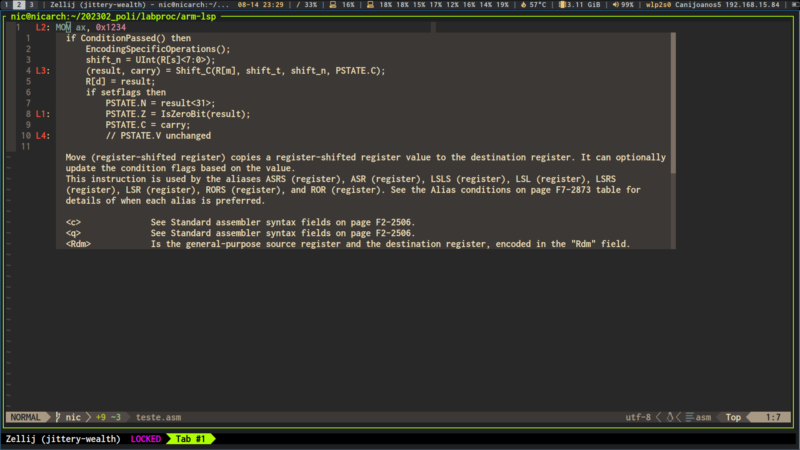
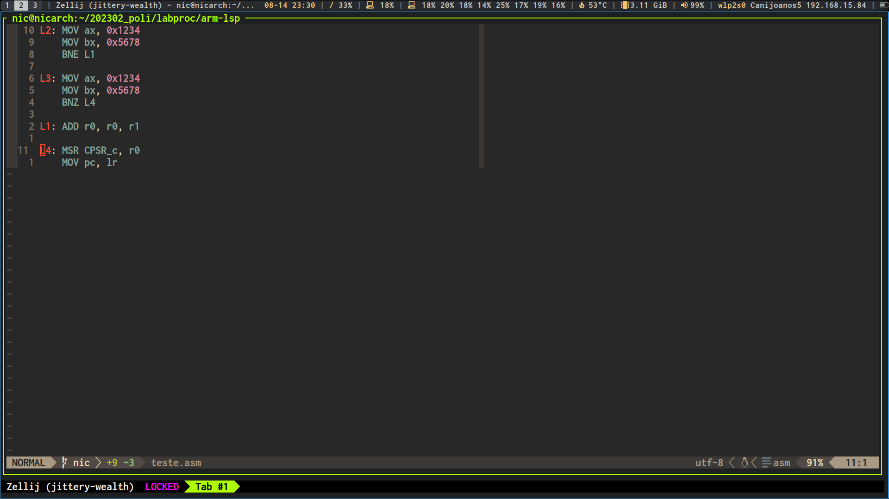

# arm-lsp

The arm-lsp is a Language Server for the Armv7 architecture.

With support for ARM32 and Thumb instructions.

## What is an LSP?

From the Microsoft specification website:

Adding features like auto complete, go to definition, or documentation on hover for a programming language takes significant effort. Traditionally this work had to be repeated for each development tool, as each tool provides different APIs for implementing the same feature.

A Language Server is meant to provide the language-specific smarts and communicate with development tools over a protocol that enables inter-process communication.

The idea behind the Language Server Protocol (LSP) is to standardize the protocol for how such servers and development tools communicate. This way, a single Language Server can be re-used in multiple development tools, which in turn can support multiple languages with minimal effort.

## Features

- Hover: shows instruction name, description, operation, summary and symbols.
- GoToDefinition: goes to the definition of a symbol, such as a Label.

# Quickstart - Neovim

For usage in Neovim, create a file called init.lua in the root directory
of the ARM32 project you're currently working on, with the following contents:

```lua
vim.lsp.start({
    name = 'arm-lsp',
    -- change to the PATH for the executable of this language server
    cmd = { './target/debug/arm-lsp' },
    root_dir = vim.fs.dirname(vim.fs.find({ 'Cargo.toml' }, { upward = true })[1]),
    filetypes = { 'asm', 's' },
})

vim.api.nvim_create_autocmd('LspAttach', {
    callback = function(args)
        local client = vim.lsp.get_client_by_id(args.data.client_id)
        if client.server_capabilities.hoverProvider then
            vim.keymap.set('n', 'K', vim.lsp.buf.hover, { buffer = args.buf })
            vim.keymap.set('n', 'gd', vim.lsp.buf.definition, { buffer = args.buf })
        end
    end,
})
```

This way, when you are working on an assembly file, the language server will
attach and provide its functionality.

# Demo 

Hover:
 

GoToDefinition:
 
 

More examples at doc folder:
[doc](./doc) 

# Troubleshooting

For manual restart of the LS, run either:

```
:LspRestart
```

or

```
so init.lua
```

Before reporting a bug, check your logs and the output of :LspInfo. Add the following to your init.lua to enable logging:

```
vim.lsp.set_log_level("debug")
```

Attempt to run the language server, and open the log with:

```
:LspLog
```

Most of the time, the reason for failure is present in the logs.

# ToDo

- Autocomplete
- Error checking
